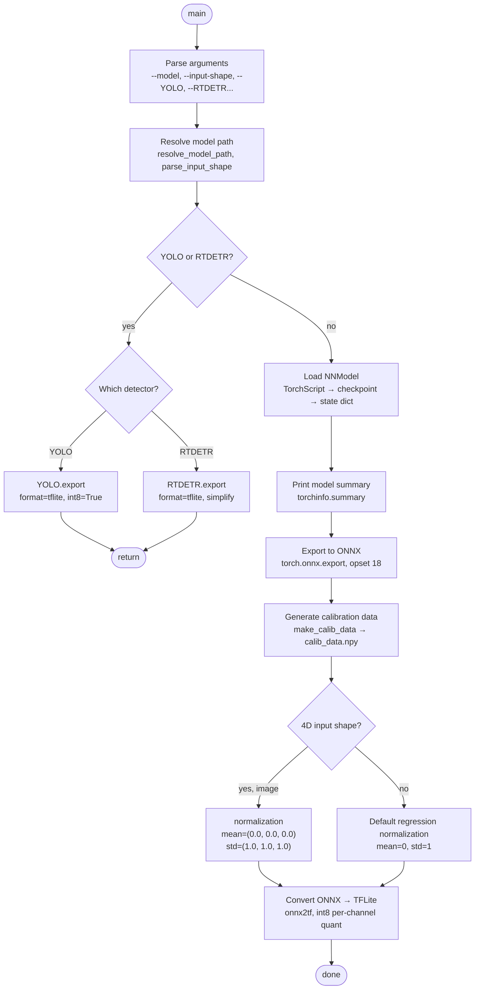

```mermaid
flowchart TB
    A(["main"]) --> B["Parse arguments\n--model, --input-shape, --YOLO, --RTDETR..."]
    B --> C["Resolve model path\nresolve_model_path, parse_input_shape"]
    C --> D{"YOLO or RTDETR?"}
    D -- yes --> E{"Which detector?"}
    E -- YOLO --> F["YOLO.export\nformat=tflite, int8=True"]
    E -- RTDETR --> G["RTDETR.export\nformat=tflite, simplify"]
    F --> H(["return"])
    G --> H
    D -- no --> I["Load NNModel\nTorchScript → checkpoint → state dict"]
    I --> J["Print model summary\ntorchinfo.summary"]
    J --> K["Export to ONNX\ntorch.onnx.export, opset 18"]
    K --> L["Generate calibration data\nmake_calib_data → calib_data.npy"]
    L --> M{"4D input shape?"}
    M -- yes, image --> N["normalization <br/>mean=(0.0, 0.0, 0.0)<br/> std=(1.0, 1.0, 1.0)"]
    M -- no --> O["Default regression normalization\nmean=0, std=1"]
    N --> P["Convert ONNX → TFLite\nonnx2tf, int8 per-channel quant"]
    O --> P
    P --> Q(["done"])

    N@{ shape: rect}
```